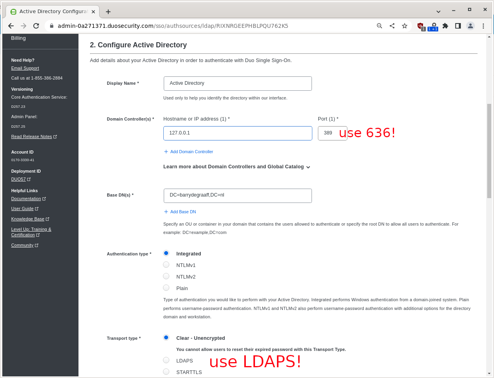

# Zimbra with on Cisco Duo cloud based Single Sign-On

In this article you will learn how to set-up Zimbra on Cisco Duo. Cisco Duo is a cloud based identity and access management solution developed by Cisco. Cisco Duo focusses on Two-Factor Authentication (2FA) and integrations with on premise Active Directory, and cloud based SAML IDP's such as Azure AD, AD FS, Google, Okta, OneLogin, Ping or any other SAML 2.0 Identity Provider. Cisco Duo calls these integrations Authentication Sources.

The technology used in this article is SAML, an open standard for Single Sign-On. When using SAML an Identity Provider (IdP) will take care of user authentication after which users can use their applications without having to log-on to each of them separately. In SAML these applications are called Service Providers (SP). 

Cisco Duo is a SAML IdP and Zimbra is a SAML SP.

Learning objectives:

- How-to Install set-up Active Directory in Cisco Duo. 
- Configuring Zimbra as a SAML SP on Cisco Duo. 
- Understand you do not need Active Directory to use Zimbra with Cisco Duo

## Pre-requisites

This article assumes you already have set-up an Active Directory with the following roles:

- Active Directory Certificate Services
- Active Directory Domain Services
- DNS Server

But you can also use a different Authentication Source, in which case you may not need Active Directory. 

### Choose your Authentication Source

To make Cisco Duo work you will need to have at least one Authentication Source. In this article we will use an on-premise Active Directory installed on a Windows 2022 server.

### Email domain

Cisco Duo requires that you validate ownership of your domain via a TXT record in DNS.

### Setting up users

Each user needs to have an account in Active Directory, Cisco Duo and Zimbra.

There is a synchronization tool that syncs users from Active Directory to Cisco Duo you can read details here: https://duo.com/docs/adsync

Zimbra also has a feature to create users based on them existing in Active Directory you can read details here: https://wiki.zimbra.com/wiki/How_to_configure_auto-provisioning_with_AD

This article does not use any of these tools, instead one account is created manually in all these systems.

It is important to understand that the email address attribute is used to identifiy the user and it's account which means you have to set it equal for the accounts in the 3 systems.

## Setting up Cisco Duo and Active Directory

In this article the example domain barrydegraaff.nl is used for the Zimbra domain and the Active Directory domain. The Cisco Duo URL's in this article look like https://sso-0a271371.sso.duosecurity.com/saml2/sp/DI724LMXVX1MSXJG8277/sso you should use your own domain and copy-paste the values provided from the Cisco Duo dashboard during the set-up.

First step register for a free 30-day Cisco Duo trial at https://duo.com/trial. 

Log on to your Cisco Duo trial from your Windows Server. You can also do this remote but this will be a little more complex.


In the Single Sign-On menu under Add Authentication Source click Add an Active Directory.


Click Add Authentication Proxy.


Click Download installer.


Execute the downloaded binary and complete the wizard.


Keep the Open Authentication Proxy configuration file option checked and click Finish.


Configure the authentication proxy with the values found on the screen in Cisco Duo, in this example:

```
[ad_client]
host=127.0.0.1
service_account_username=Administrator
service_account_password=******
search_dn=CN=Users,DC=barrydegraaff,DC=nl

[sso]
; Remote Identity Key, unique to this authentication source
rikey=*******get-from-duo-dashboard
```

In this example we used the local administrator account, but you can also create a service account with reduced access rights. Make sure the search_dn matches your Active Directory domain. And click Validate. If the only error is about the enrollment code script that has not been ran yet you can click Save.


Click Save and continue.


Open a Command Prompt with elevated privileges.


Paste the command provided via the Cisco Duo dashboard.


Run the command provided via the Cisco Duo dashboard.


Go back to the Cisco Duo dashboard and click Run test.


If no errors are reported you can click Return to Configuration.


Next you have to enter your Base DN, Active Directory port and IP. In case you active directory is on the public Internet you can put the public IP. In case it is internal only you can put 127.0.0.1. In this example we omitted the set-up of LDAPS on our Active Directory so we use port 389. You should use port 636 and use LDAPS Transport Type.


Scroll down and click Run tests.


If the only error is about not having a Permitted Email Domain, click Save and Yes, enable this source.


Click Go Back to Single Sign-On and then re-open the Active Directory Authentication Source. Then add your email domain under Add Email Domain.


Add the TXT record to your public DNS and click Verify.


If all goes well you should be Verified!


Create a test user in Active Directory.


Create a test user in Cisco Duo.


Create a test user in Zimbra.


Cisco Duo does want users to Enroll (set-up 2FA) within some time frame, you can trigger this by sending the user an email:


## Setting up Zimbra in Cisco Duo


Go to Applications and click Protect an Application.


Select the Generic SAML Service Provider and click Protect.


From this screen you have to copy/paste and store for use on Zimbra:

1. The Single Sign-On URL
2. The Single Log-Out URL

And you have to click Download certificate and store the IDP certificate.


You have to add under Service Provider:

| Field | Value |
|---|---|
| Entity ID | https://zimbra10.barrydegraaff.nl/service/extension/samlreceiver |
| Assertion Consumer Service (ACS) URL | https://zimbra10.barrydegraaff.nl/service/extension/samlreceiver |
| Single Logout URL | https://zimbra10.barrydegraaff.nl/service/extension/samlslo |

Scroll down and click Save.


## Setting up Zimbra

Store the IDP certificate on your Zimbra server in `/tmp/idpcert.pem` the contents should look like:

```
root@zimbra10:~# cat /tmp/idpcert.pem
-----BEGIN CERTIFICATE-----
MIIDDTCCAfWgAwIBAgIUBb3pxQ9R5RU+wBnebb865iPRT/wwDQYJKoZIhvcNAQEL
BQAwNjEVMBMGA1UECgwMRHVvIFNlY3VyaXR5MR0wGwYDVQQDDBRESTcyNExNWFZY
MU1TWEpHODI3NzAeFw0yMzAxMzExMTUzMzRaFw0zODAxMTkwMzE0MDdaMDYxFTAT
BgNVBAoMDER1byBTZWN1cml0eTEdMBsGA1UEAwwUREk3MjRMTVhWWDFNU1hKRzgy
NzcwggEiMA0GCSqGSIb3DQEBAQUAA4IBDwAwggEKAoIBAQDHYFQf+drYlbiXyeap
hhxpb07V6dZs7oCVbKi3gHVHgH880qYBkYUu3VyZhjhomlNiANCyNl6KBrSJ3Myv
xWKYgZtRRJ9cbnhloQIXExU9IGa0SPTUya35fOcYt0/tHJiRPCt92AyjfOSPGb0X
H405Qd7/7xI7B5RokaRu02fY/3LnUdODEEGWA3bciF4ajO1erRhK7c0GPjPeZZQS
ekAhrKYk47O1zYHue381x89zAdTgI2lgri4/erI/kyquFVJZXe8yjdHPveiA7ZO1
3sHRF7DKMwKaLYYHrRETpCeidT8eW9QV5E6Ig2V3BK+gUxLIxiJxHXdQJGgZKYSw
CA8rAgMBAAGjEzARMA8GA1UdEwEB/wQFMAMBAf8wDQYJKoZIhvcNAQELBQADggEB
AAbDm6ZG1v+OjY2h1/dckab817w5lxiM/dyRNeuk0Udj0IrTgcJht2Jd4RAbucUz
LlsTApxWbW280q0aX1/3JQhy4h5a7mWI1hwdDO3SCoUp9UfK7WxzLxmdn3t295+r
J5Fnbfxgry146/lvkjTxsWybvqQf91fe5FJCPKO3MJbhOW0/1lk4ZDOV/kUwSG9P
ElahxwVtuADCqvUmPUyd1NPDkaBLxNXgLCZPC53F1gSY3ntQdYWRy3KzXwQ8evSK
e+0kTSZKVvI2B0vH0J3WSflPBhpharPiG0Y/WzpMVxvarArgNX0Cc1VLnSOiLmpg
BJA6lsuHCNK5GBcLzfPOZUA=
-----END CERTIFICATE-----

```

From the command line create the saml folders by running as root:

```
mkdir /opt/zimbra/lib/ext/saml
mkdir /opt/zimbra/conf/saml/
```
Add the file `/opt/zimbra/conf/saml/saml-config.properties` to configure SAML in Zimbra. Please note that you will have to use 2 different URL's for Cisco Duo, The Single Sign-On URL and the Single Log-Out URL. Also do not forget to replace zimbra10.barrydegraaff.nl with your actual Zimbra server domain. Example contents:

```
# Issuer
saml_sp_entity_id=https://zimbra10.barrydegraaff.nl/service/extension/samlreceiver
# Login receiver for the service provider
saml_acs=https://zimbra10.barrydegraaff.nl/service/extension/samlreceiver
# Name ID format for the IDP to use in the SAMLResponse
saml_name_id_format=urn:oasis:names:tc:SAML:1.1:nameid-format:emailAddress
# Date format for issue instant
saml_date_format_instant=yyyy-MM-dd'T'HH:mm:ss'Z'
# Identity provider login endpoint for redirect method
saml_redirect_login_destination=https://sso-0a271371.sso.duosecurity.com/saml2/sp/DI724LMXVX1MSXJG8277/sso
# Identity provider login endpoint for POST method
saml_post_login_destination=https://sso-0a271371.sso.duosecurity.com/saml2/sp/DI724LMXVX1MSXJG8277/sso
# Identity provider logout endpoint for redirect method
saml_redirect_logout_destination=https://sso-0a271371.sso.duosecurity.com/saml2/sp/DI724LMXVX1MSXJG8277/slo
# Identity provider logout endpoint for POST method
saml_post_logout_destination=https://sso-0a271371.sso.duosecurity.com/saml2/sp/DI724LMXVX1MSXJG8277/slo
# Logout redirect page if we are the landing page logout endpoint
saml_landing_logout_redirect_url=/
# Disable the audience path check
saml_skip_audience_restriction=true
# URL to send the user with error_code, error_msg query params. Default results in HTTP error code pages.
saml_error_redirect_url=
# The SAML logout document encoding, and SAML login receiver parameter encoding.
saml_document_encoding=ASCII
# Set to true to disable the audience path check.
saml_skip_audience_restriction=false
# The redirect location to send the user if their Zimbra account is not active.
saml_inactive_account_redirect_url
# The redirect location to send the user if webclient login for their Zimbra account is disabled.
saml_webclient_disabled_account_redirect_url
```

From the command line as user root copy the samlextn.jar and set up the IDP certificate like this:

```
cp /opt/zimbra/extensions-network-extra/saml/samlextn.jar /opt/zimbra/lib/ext/saml/
su - zimbra
cat /tmp/idpcert.pem |xargs -0 zmprov md barrydegraaff.nl zimbraMyoneloginSamlSigningCert
# zmprov mcf zimbraCsrfRefererCheckEnabled FALSE
zmprov mcf zimbraCsrfAllowedRefererHosts sso-0a271371.sso.duosecurity.com
# new since 9.0.0 patch 25 you are required to set zimbraVirtualHostName:
zmprov md barrydegraaff.nl zimbraVirtualHostName zimbra10.barrydegraaff.nl
/opt/zimbra/bin/zmlocalconfig -e zimbra_same_site_cookie=""  #read below section!
zmmailboxdctl restart
```

### SameSite Cookie restriction and SAML

If your IDP and Zimbra are on the same domain in an on-premise deployment. For example zimbra.example.com and saml-idp.example.com you can use SameSite cookie setting Strict:

```
/opt/zimbra/bin/zmlocalconfig -e zimbra_same_site_cookie="Strict"
zmmailboxdctl restart
```

If your IDP is under a different domain in a hosted SaaS IDP deployment. For example zimbra.example.com and saml.authprovider.org you probably have to disable the SameSite cookie setting as follows:

```
/opt/zimbra/bin/zmlocalconfig -e zimbra_same_site_cookie=""
zmmailboxdctl restart
```
In the case of Cisco Duo the `zimbra_same_site_cookie=""` will be used.

### Configurable Properties saml-config.properties

The samlextn.jar uses a property file located at: `${zimbra_home}/conf/saml/saml-config.properties`.

The following properties are supported:

| Key | Description | Default | Optional |
| --- | ----------- | ------- | -------- |
| saml_sp_entity_id | Issuer | | |
| saml_acs | Login receiver for the service provider | | |
| saml_redirect_login_destination | Identity provider login endpoint for redirect method | | |
| saml_redirect_logout_destination | Identity provider logout endpoint for redirect method | | |
| saml_post_login_destination | Identity provider login endpoint for POST method (unused) | | √ |
| saml_post_logout_destination | Identity provider logout endpoint for POST method (unused) | | √ |
| saml_name_id_format | Name ID format for the IDP to use in the SAMLResponse | `urn:oasis:names:tc:SAML:1.1:nameid-format:unspecified` | √ |
| saml_date_format_instant | Date format for issue instant | `yyyy-MM-dd'T'HH:mm:ss'Z'` | √ |
| saml_error_redirect_url | URL to send the user with `error_code`, `error_msg` query params. Default results in HTTP error code pages. | | √ |
| saml_landing_logout_redirect_url | Logout redirect landing page if we are the last logout service. | `/` | √ |
| saml_document_encoding | The SAML logout document encoding, and SAML login receiver parameter encoding. | `ASCII` | √ |
| saml_skip_audience_restriction | Set to true to disable the audience path check. | `false` | √ |
| saml_inactive_account_redirect_url | The redirect location to send the user if their Zimbra account is not active. | `/service/extension/samllogout` | √ |

Now you are ready to log-on to Zimbra using SAML. Try a fresh browser/incognito window and go to the Single Sign-On URL that you can find in Cisco Duo Dashboard -> Applications -> Generic SAML Service Provider - Single Sign-On in this example: https://sso-0a271371.sso.duosecurity.com/saml2/sp/DI724LMXVX1MSXJG8277/sso 

If all goes well, you should now be logged-on to Zimbra. You can change the default log-in page for Zimbra using
    
```
zmprov md barrydegraaff.nl zimbraWebClientLoginURL https://sso-0a271371.sso.duosecurity.com/saml2/sp/DI724LMXVX1MSXJG8277/sso
```

### Debugging

If you are having issues you can tail the logs on Zimbra while doing a log-in.

On Zimbra:

```
tail -f /opt/zimbra/log/mailbox.log
```

On Cisco Duo you can find some logs in the UI in the Reports section:


## zimbraAuthFallbackToLocal

If you have tested Single Sign-On authentication and it works, you may want to disable Zimbra set passwords by issuing:

```
zmprov md barrydegraaff.nl zimbraAuthFallbackToLocal FALSE
#or disable Zimbra set passwords globally
zmprov mcf zimbraAuthFallbackToLocal FALSE
```

Please note that admin accounts in Zimbra always have the ability to use the password set on Zimbra, so it is suggested you set a complex password and do not use Zimbra admin accounts for daily activities.

## zimbraWebClientLoginURL

Once you disable zimbraAuthFallbackToLocal the Zimbra log-in page will no longer work, and you probably want to redirect users to use the Cisco Duo login page like this:

```
zmprov md barrydegraaff.nl zimbraWebClientLoginURL https://sso-0a271371.sso.duosecurity.com/saml2/sp/DI724LMXVX1MSXJG8277/sso
#or globally
zmprov mcf zimbraWebClientLoginURL https://sso-0a271371.sso.duosecurity.com/saml2/sp/DI724LMXVX1MSXJG8277/sso
```
